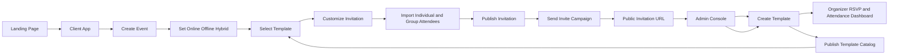

# Event Organizer SaaS Transformation Roadmap

## 1. Executive Summary

This roadmap reframes the current wedding invitation project into an **Event Organizer Tool SaaS**, not just an invitation app.

Core product outcomes:

- Plan and run **online and offline events**
- Support **single-person invites** and **group invites**
- Send **scheduled reminders**
- Track full **RSVP lifecycle** with event operations visibility

Strategic path:

- **Single-tenant first** with one operating organization
- **Multi-tenant ready** schema and service boundaries for future expansion

---

## 2. Current-State Analysis

## 2.1 Platform and Stack

- Frontend and backend are both in Next.js Pages Router
- Supabase is used for data persistence
- Tailwind UI and custom components are used for invitation rendering

## 2.2 Existing Core Features

1. **Wedding invitation experience**
   - Dynamic guest invitation page by slug: `pages/guest/[slug].tsx`
   - Wedding-focused sections: hero, couple, events, RSVP, gallery, gifts, footer

2. **Guest list management**
   - CRUD-like APIs and management pages for guest list
   - CSV import, RSVP status, message status, language toggle

3. **RSVP flow**
   - RSVP submission and guest linkage by slug
   - RSVP message storage and attendance status

4. **Basic settings**
   - Wedding date and livestream URL setting pages and APIs

## 2.3 Data and API State

Current schema is invitation-domain specific:

- `guest_list`
- `rsvp_guests`
- `live_stream_settings`
- `wedding_date_settings`

Current API for invitation data is generated from hardcoded wedding data + small DB overrides.

## 2.4 Architectural Constraints and Gaps

1. **Hardcoded domain model**
   - Wedding entities and wording are fixed in `types/wedding.ts` and wedding components

2. **No template engine abstraction**
   - Components are direct wedding sections, not modular template blocks

3. **No SaaS-ready boundaries**
   - No clear separation between platform admin, client workspace, and public invitation runtime

4. **Security posture is permissive**
   - Broad RLS `true` policies need tightening before SaaS scaling

5. **No landing/product funnel**
   - Root page currently returns 404 behavior

6. **No event operations model**
   - Current model focuses on invitation rendering, not planning tasks, run-of-show, check-in, or reminder campaigns

---

## 3. Target Product Scope

## 3.1 Required Surfaces

1. **Landing page**
   - Product story, use cases for organizers, pricing, templates showcase, CTA to create event

2. **Client app**
   - Create and plan events online or offline
   - Select and customize invitation template
   - Manage attendees as individuals and groups
   - Schedule reminders and track delivery
   - Track RSVP and attendance pipeline

3. **Admin app**
   - Manage template catalog
   - Publish and version templates
   - Manage content schema and defaults
   - Platform analytics and moderation

4. **Public invitation runtime**
   - Render invitation per event + selected template + guest personalization

5. **Operations surface**
   - Event timeline and checklist
   - Optional runbook view for event day operations

## 3.2 Functional Scope Expansion

Must-have capabilities:

- Event mode: `online`, `offline`, or `hybrid`
- Venue and streaming details
- Individual invite and group invite by segment
- Reminder campaigns before and on event day
- RSVP status tracking with change history
- Attendance tracking ready for check-in extension

## 3.3 Event Type Expansion

Support these event classes initially:

- Wedding
- Birthday
- Engagement
- Baby shower
- Graduation
- Corporate or custom event

---

## 4. Target Architecture

## 4.1 Logical Modules

- **Marketing module**: landing and conversion pages
- **Client workspace module**: event planning, template selection, customization, attendee and RSVP operations
- **Admin console module**: template lifecycle and platform controls
- **Invitation runtime module**: render engine for published pages and personalized guest URLs
- **Engagement module**: reminder scheduler, outbound campaign logs, RSVP timeline
- **Core services module**: auth, media, messaging integration, analytics

## 4.2 Single-Tenant First to Multi-Tenant Path

Phase 1 still uses one operating org, but schema includes future-ready keys:

- Add nullable `organization_id` and `workspace_id` in key tables now
- Backfill with default org and workspace
- Enforce app-level scoping immediately
- Move to strict RLS tenant filtering in later phase

## 4.3 Suggested High-Level Flow

---

## 5. Domain Model Refactor Plan

## 5.1 Replace Wedding-Centric Types with Generic Event Organizer Types

From current `WeddingData` toward:

- `Event`
  - `id`, `slug`, `event_type`, `mode`, `title`, `host`, `start_datetime`, `end_datetime`, `timezone`, `status`
- `EventLogistics`
  - `event_id`, `venue_name`, `venue_address`, `map_url`, `stream_url`, `stream_platform`, `access_notes`
- `Template`
  - `id`, `code`, `name`, `category`, `version`, `status`, `schema_json`
- `EventTemplateSelection`
  - `event_id`, `template_id`, `template_version`
- `InvitationContent`
  - `event_id`, `content_json`, `theme_json`, `media_json`
- `Attendee`
  - generalized attendee profile and invite channel state
- `AttendeeGroup`
  - group name, segment, and membership
- `RsvpResponse`
  - per attendee response and optional companions
- `ReminderCampaign`
  - event-scoped reminder schedule and target segment
- `ReminderDelivery`
  - per attendee delivery status and timestamps

## 5.2 Proposed Table Set

New or evolved tables:

1. `organizations` future-ready, starts with one default record
2. `workspaces` future-ready logical grouping
3. `users` and `user_workspace_roles`
4. `events` generalized event records
5. `event_logistics` venue and online session details
6. `event_hosts` optional multiple hosts
7. `templates`
8. `template_versions`
9. `event_template_selections`
10. `event_contents`
11. `event_settings` timezone, locale, SEO, visibility
12. `attendees`
13. `attendee_groups`
14. `attendee_group_members`
15. `rsvp_responses`
16. `invite_campaigns`
17. `invite_deliveries`
18. `reminder_campaigns`
19. `reminder_deliveries`
20. `media_assets`
21. `event_tasks` optional planning checklist module

Deprecation path:

- Keep `guest_list` and `rsvp_guests` during transition
- Add compatibility views or mapper layer
- Migrate data in batches

---

## 6. Template System Design

## 6.1 Admin Template Lifecycle

1. Draft template
2. Configure editable schema fields
3. Preview with sample data by event type
4. Publish immutable version
5. Deprecate old versions without breaking existing events

## 6.2 Template Contract

Each published template version contains:

- Metadata: name, category, supported event types
- Layout blocks
- Editable field schema
- Validation rules
- Default content and theme tokens

## 6.3 Client Customization Model

Client edits are stored as overrides:

- Base template content and style
- Event-level override patch for text, color, media, visibility
- Optional guest-level personalization tokens

This ensures template updates remain manageable and event data remains portable.

## 6.4 Event Mode Aware Blocks

Template block schema should support conditional blocks:

- Show venue block when mode contains offline
- Show streaming block when mode contains online
- Show access instructions based on event settings

---

## 7. UX and Route Strategy

## 7.1 Landing

- `/`
- `/templates`
- `/pricing`
- `/features`
- `/demo`

## 7.2 Client App

- `/app`
- `/app/events`
- `/app/events/new`
- `/app/events/[eventId]/editor`
- `/app/events/[eventId]/planning`
- `/app/events/[eventId]/guests`
- `/app/events/[eventId]/groups`
- `/app/events/[eventId]/rsvp`
- `/app/events/[eventId]/reminders`
- `/app/events/[eventId]/publish`

## 7.3 Admin App

- `/admin`
- `/admin/templates`
- `/admin/templates/new`
- `/admin/templates/[templateId]/versions`
- `/admin/templates/[templateId]/versions/[versionId]/editor`

## 7.4 Public Runtime

- `/i/[eventSlug]`
- `/i/[eventSlug]/[guestSlug]`

---

## 8. Security and Access Model

## 8.1 Immediate Improvements

- Introduce authenticated admin and client areas
- Protect admin routes with role checks
- Lock down write endpoints to authenticated roles

## 8.2 RLS Evolution

Phase 1 single-tenant:

- Restrict write operations to service role via API
- Limit anon reads only for published invitation runtime data

Phase 2 multi-tenant:

- Enforce row filters by `organization_id` and membership
- Separate admin and client capabilities by role table

---

## 9. Migration Strategy from Existing Project

## 9.1 Preserve Working Wedding Product First

1. Keep current wedding flow intact under legacy route path
2. Build generic modules in parallel
3. Incrementally move guest and RSVP operations to generalized services

## 9.2 Adapter Approach

- Add mapping layer converting legacy wedding shape into generic event content
- Reuse existing wedding components as first template package
- Make wedding template the first entry in template catalog

## 9.3 Data Migration Steps

1. Create new generalized tables
2. Backfill one default organization and workspace
3. Copy `guest_list` into `attendees`
4. Derive default `attendee_groups` and `attendee_group_members` from existing group flags
5. Copy `rsvp_guests` into `rsvp_responses`
6. Seed first `invite_campaigns` records from current invitation status data
7. Convert hardcoded wedding data into one seeded `event`, `event_logistics`, and `event_contents`
8. Verify parity in rendered invitation, RSVP counts, and invitation delivery metrics

---

## 10. Phased Roadmap

## Phase A Foundation and Safety

- Add auth and role guardrails
- Tighten API authorization and RLS strategy
- Create generalized domain types and repository interfaces
- Add event mode and logistics schema foundations
- Keep legacy routes alive

## Phase B Core SaaS Skeleton

- Build landing page and product pages
- Build client app shell and event dashboard
- Build admin app shell and template management basics
- Create generalized `events`, `event_logistics`, `templates`, `event_contents` flow

## Phase C Template Engine and Editor

- Build template schema format and renderer abstraction
- Implement admin template create, version, publish
- Implement client template selection and customization editor
- Build preview and publish workflow

## Phase D Attendee, Invite, and RSVP Generalization

- Port guest list features into event-scoped attendee module
- Add individual and group attendee management
- Port RSVP APIs to generic response service
- Add invitation campaign and delivery tracking for WA and email

## Phase E Reminder Automation and Operations

- Build reminder campaign scheduler
- Support segment-based reminders for individual and group targets
- Track reminder delivery and engagement metrics
- Add event planning checklist and optional runbook view

## Phase F Public Runtime and Performance

- Deliver stable public runtime routes
- Add SEO metadata per event template
- Optimize media, caching, and hydration boundaries

## Phase G Multi-Tenant Readiness

- Introduce tenant keys in all tables and service filters
- Add organization onboarding and workspace ownership flows
- Harden RLS for strict tenant isolation

---

## 11. Detailed Backlog Buckets

1. **Architecture and data**
   - Generic schema, migration SQL, compatibility views

2. **Frontend foundations**
   - Design system tokens for multi-theme templates
   - Shared block renderer

3. **Admin template management**
   - Template CRUD, versioning, publication state machine

4. **Client invitation builder**
   - Content editor, media picker, section toggles, style controls

5. **Attendee, invite, and RSVP**
   - Import, segmentation, invite status, RSVP dashboard

6. **Reminder automation**
   - Campaign scheduler, message templates, retry and delivery logs

7. **Landing and growth**
   - SEO content, conversion funnel, template gallery

8. **Security and operations**
   - AuthZ, audit logs, observability, error tracking

---

## 12. Acceptance Criteria for Transformation Success

1. Organizer can create online, offline, and hybrid events end-to-end
2. Organizer can invite individual attendees and attendee groups
3. Admin can create template and publish a new version
4. Client can select template and customize content without code
5. Reminder campaigns can be scheduled and delivery tracked
6. Invitation URL supports personalized view and RSVP updates
7. Legacy wedding invitation remains functional during migration
8. Data model supports future tenant scoping without breaking changes

---

## 13. Recommended First Implementation Slice

Build the thinnest vertical slice:

1. Landing page with CTA
2. Client creates one hybrid event
3. Client selects one seeded template
4. Client customizes title, date, venue, stream URL, hero image, and color
5. Client imports one individual attendee and one group attendee segment
6. Publish public invitation URL
7. Send one invite campaign and one reminder campaign
8. RSVP responses appear in organizer dashboard with delivery logs

This slice validates the full generalized architecture before scaling template complexity.
