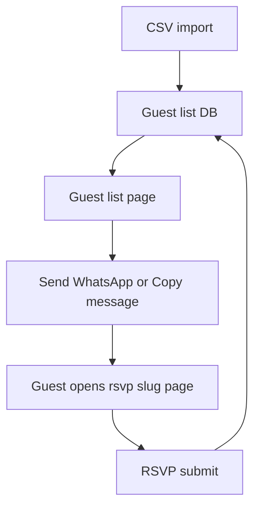

# Guest list + per-guest RSVP upgrade plan

## Goals
- Replace the current RSVP-only flow with a guest-list management system.
- Support CSV import for guest list data.
- Provide WhatsApp send + copy message actions per guest, track sent status.
- Split views for messaged vs not messaged and invited vs not invited.
- Provide guest-specific RSVP pages at `/rsvp/[slug]` using `NEXT_PUBLIC_SITE_URL` for message links.

## Current touchpoints
- RSVP admin list: [pages/rsvp-data.tsx](pages/rsvp-data.tsx:1)
- RSVP form component: [components/wedding/RSVP.tsx](components/wedding/RSVP.tsx:1)
- RSVP API: [pages/api/submit-rsvp.ts](pages/api/submit-rsvp.ts:1)
- DB helpers: [lib/db.ts](lib/db.ts:1)

## Data model (proposed)
New table `guest_list` (or extend existing `rsvp_guests` into two tables to avoid mixing invitees and submissions):

| Field | Type | Notes |
| --- | --- | --- |
| id | integer | PK |
| name | text | required |
| title | text | optional (Mr/Bpk/Ibu/Sdr/Sdri) |
| whatsapp | text | required |
| slug | text | required, unique, derived from name |
| invited | boolean | default true/false per CSV |
| rsvp_status | text | attending, not_attending, not_responded |
| message_sent | boolean | default false |
| message_sent_at | text | optional |
| created_at | text | default now |
| updated_at | text | default now |

Guest RSVP submissions (if separate table):
| Field | Type | Notes |
| --- | --- | --- |
| id | integer | PK |
| guest_id | integer | FK guest_list.id |
| attendance | text | attending, not_attending |
| message | text | optional |
| submitted_at | text | default now |

## CSV import mapping
Accepted columns (case-insensitive):
- `name` (required)
- `title` (optional)
- `whatsapp` (required)
- `invited` (optional, true/false)
- `rsvp_status` (optional, attending/not_attending/not_responded)

Rules:
- `slug` derived from `name` and de-duplicated on conflicts.
- `message_sent` defaults to false on import.
- `language` optional (`id` or `en`), default `id`.

## API plan
New endpoints under `pages/api/guest-list/*` or extend `pages/api/submit-rsvp.ts` with subroutes:

1. `GET /api/guest-list` - list guests with filters for invited, message_sent, rsvp_status.
2. `POST /api/guest-list` - create guest entry.
3. `PATCH /api/guest-list/:id` - update invited, message_sent, rsvp_status.
4. `DELETE /api/guest-list/:id` - delete guest.
5. `POST /api/guest-list/import` - CSV upload and import.
6. `GET /api/guest-list/:slug` - fetch guest by slug for RSVP page.
7. `POST /api/guest-list/:slug/rsvp` - submit attendance + message.

## Pages and UI plan
1. Guest List Management page
   - Replace or add alongside [pages/rsvp-data.tsx](pages/rsvp-data.tsx:1).
   - Features:
     - CSV import button.
     - Table columns: Title, Name, WhatsApp, Invited, RSVP Status, Message Sent.
     - Actions: WhatsApp send, Copy message, Mark sent, Edit, Delete.
     - Filters: Invited yes/no, Message sent yes/no, RSVP status.

2. Guest-specific RSVP page
   - New route: `pages/rsvp/[slug].tsx`.
   - Load guest by slug (SSG/SSR) and show:
     - Guest name and title.
     - RSVP form: attendance (attending / not attending) + message.
   - Form submission updates guest RSVP status and saves message.

## Message composition
Templates (by guest language):

```
ID:
Assalamualaikum/Hi {title} {name},
Kami mengundang Anda ke pernikahan kami. Silakan RSVP di link berikut:
{siteUrl}/rsvp/{slug}
Terima kasih.

EN:
Hello {title} {name},
We would like to invite you to our wedding. Please RSVP at:
{siteUrl}/rsvp/{slug}
Thank you.
```

- WhatsApp button uses `https://wa.me/{whatsapp}?text={encodedMessage}`.
- Copy button copies same message to clipboard.
- `siteUrl` from `NEXT_PUBLIC_SITE_URL` with fallback to current origin.

## Filtering and status separation
- Default tabs or filter chips:
  - Message Sent: Sent / Not Sent
  - Invited: Invited / Not Invited
  - RSVP Status: Attending / Not Attending / Not Responded

## Mermaid flow


## Implementation steps
1. Extend DB schema and helper functions in [lib/db.ts](lib/db.ts:1).
2. Build guest list APIs and CSV import handling.
3. Create guest list page UI and filters.
4. Add guest-specific RSVP route and update RSVP form.
5. Add WhatsApp + copy actions and message sent tracking.
6. Validate migrations or initialize data; confirm existing RSVP data handling.

